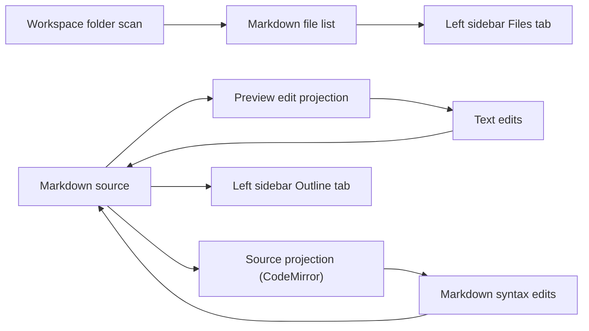

# Markdown Editor WYSIWYG Preview Design

## Overview

This design defines the next iteration of the desktop Markdown editor. The goal is to make the app feel closer to Typora-style editing while keeping Markdown source as the single source of truth.

The current implementation direction is:

- left sidebar with `Files` and `Outline` tabs
- default main view as a live preview editing surface
- `Ctrl + /` toggles between preview edit mode and source mode
- source mode uses CodeMirror 6 for direct Markdown editing
- preview mode supports direct text editing in rendered content
- the file list shows only Markdown files, including deep nested files, with relative-path context
- the preview renders more Markdown syntax than the current MVP
- typography is scaled up so the UI is closer to Typora reading density

This iteration is focused on local editing behavior and workspace browsing. SQLite-backed recent files and settings persistence remain a later layer unless they are already required by the existing scaffold.

## Scope

### In Scope

- default to live preview edit mode on document open
- `Ctrl + /` toggles preview edit mode and source mode in both directions
- preview edit mode allows direct text edits in rendered content
- source mode allows direct Markdown syntax editing and styling syntax changes
- left sidebar `Files` tab displays a flat Markdown file list
- left sidebar `Outline` tab displays heading outline for the active document
- recursive scan of workspace folders for `.md` files only
- file cards show relative-path context above each file entry
- clicking a file card opens that Markdown file
- preview rendering for:
  - headings
  - lists
  - fenced code blocks
  - blockquotes
  - tables
  - links
  - images
  - inline code
  - italic text
  - bold italic text
  - superscript
  - subscript
  - definition lists
  - HTML line breaks
- code blocks use a gray background for visual separation
- typography scale is increased for both the editor surface and preview
- preserve the current active document when folder/file loading fails

### Out of Scope

- multi-tab document editing
- rename, move, delete, drag-and-drop, or search in the file browser
- SQLite recent-file persistence and settings persistence
- collaborative editing
- cloud sync or backend services
- full rich-text formatting toolbar

## User Experience

### Default Mode

When a document is opened, the app should immediately show the rendered preview editing surface rather than a source editor. This keeps the main interaction close to what the user asked for: the page starts in a readable document view and the user edits text directly in that view.

### Mode Switching

`Ctrl + /` toggles between:

- `preview-edit` mode: the rendered document is editable as text
- `source` mode: the Markdown source is editable in CodeMirror

The toggle should be symmetric. Pressing the shortcut again returns to the previous mode without changing the active document.

### Left Sidebar

The left sidebar is a fixed navigation panel with two tabs:

- `Files`
- `Outline`

The `Files` tab is not a tree control. It is a flat, scrollable list of Markdown file cards similar to the screenshot the user provided.

Each file card should include:

- relative directory context or parent path label
- file name
- optional excerpt or summary line if available
- optional modified-time label if available from file metadata

The `Outline` tab shows the heading structure of the current document. Clicking a heading scrolls to that section in the active document.

### Editing Behavior

The preview editing surface is text-first:

- users can change visible text content directly
- structure-level or syntax-level edits that are hard to map safely should fall back to source mode
- source mode remains the safest place for style syntax changes, especially inline formatting and complex block rewrites

The app should not maintain separate document bodies for preview and source. There is one Markdown string, and both modes mutate that same string.

## Architecture

The implementation should use a single canonical Markdown document model with two editing projections.

### Frontend Responsibilities

- React components handle layout, tab switching, keyboard shortcuts, and user interaction.
- Zustand owns workspace state, active document state, current mode, file list, outline data, and error state.
- The file list view renders a flat list of Markdown file cards from store state.
- The outline view renders heading items derived from the current Markdown content.
- The preview edit surface renders the current document and writes text changes back into the same document state.
- The source mode uses CodeMirror 6 with Markdown extensions.

### Tauri Responsibilities

- folder scanning returns a recursive list of Markdown files only
- file reading loads a single Markdown file into memory
- file saving writes the Markdown string back to disk
- the frontend never needs to build its own filesystem tree from arbitrary files

### Markdown Parsing and Rendering

The Markdown pipeline should be split into two layers:

1. block and inline parsing used to understand structure, headings, and editable spans
2. rendering plugins used to display the document consistently in preview and source-aware preview mode

The preview layer should support raw HTML line breaks, GFM tables, and the inline formatting variants listed in scope. If a syntax cannot be mapped safely in preview edit mode, source mode is the fallback.

## Data Model

### Markdown File Entry

Each file in the left sidebar file list should include:

- absolute file path
- workspace-relative path
- display name
- parent-relative directory label
- optional excerpt
- optional modified time
- active state

### Outline Item

Each outline entry should include:

- heading text
- heading level
- source position or anchor key
- active state

### Editor State

The document state should include:

- current file path or null for untitled content
- display name
- Markdown source text
- dirty flag
- current mode: `preview-edit` or `source`
- current outline items
- current sidebar tab
- error message

## Workspace and File List Behavior

### Folder Open

When the user opens a folder:

1. the app scans the folder recursively
2. only `.md` files are returned
3. the result is normalized into a flat list of Markdown file entries
4. the `Files` tab renders those entries
5. clicking a card opens that Markdown file

This behavior fixes the current file-open problem by separating file discovery from file activation. The file list does not depend on a tree expansion state.

### File Open

When the user opens a Markdown file:

1. the file content is loaded from disk
2. the document state is replaced with the file content
3. the active mode remains whatever the user last selected unless the file load is a fresh document open
4. the outline is regenerated from the loaded content

If no workspace folder is loaded yet, opening a file should still work. In that case the sidebar may show only the active file context or an empty file list state.

### Relative Path Display

File cards should show the file's location relative to the workspace root rather than the raw absolute path. That makes deep files understandable at a glance and matches the screenshot behavior.

## Markdown Support Strategy

### Rendering Support

The preview renderer should visibly support:

- headings
- lists
- fenced code blocks
- blockquotes
- tables
- links
- images
- inline code
- italic
- bold italic
- superscript
- subscript
- definition lists
- HTML ` `

### Visual Styling

- body text should use a larger base font size than the current implementation
- code blocks should use a muted gray background
- inline code should remain visually distinct but not overpower body text
- the preview should feel readable at Typora-like density rather than compact editor density

### Editing Strategy

- preview edit mode uses editable rendered blocks
- source mode uses the Markdown source string directly
- source mode is required for syntax edits that are difficult to map safely in preview mode
- preview edit mode should favor text editing over structural editing

## Error Handling

The app should fail visibly and preserve the current document when possible.

- folder scan failure: keep the current document visible and show an error
- file load failure: keep the current document visible and show the failing path
- save failure: preserve the dirty flag and surface the error
- preview-to-source mapping failure: keep content intact, surface the issue, and allow switching to source mode
- unsupported file selection: ignore or reject non-Markdown files from app-controlled flows

## Testing Strategy

### Frontend Unit Tests

- Markdown file scanning returns only `.md` entries and keeps relative path metadata
- outline generation returns heading items in source order
- mode toggling switches between preview edit and source mode
- preview edit writes text changes back to the shared Markdown string
- source mode receives the same document content as preview mode

### Frontend Component Tests

- default mode is preview edit
- `Ctrl + /` toggles modes both ways
- file list tab shows Markdown cards with relative path labels
- outline tab shows heading items for the active document
- clicking a file card loads the selected document
- code blocks render with the gray background styling

### Rust Tests

- recursive folder scan returns only Markdown files
- deep nested Markdown files are included
- file read returns expected contents
- file write persists expected contents

## Acceptance Criteria

The iteration is complete when all of the following are true:

- the app opens in preview edit mode by default
- `Ctrl + /` toggles between preview edit mode and source mode in both directions
- the preview can be edited directly for text content
- source mode can edit Markdown syntax and style markers
- the left sidebar shows a file list tab and an outline tab
- the file list shows only Markdown files, including deep nested files
- each file entry shows relative-path context
- clicking a file entry opens that file
- the outline reflects the active document headings
- code blocks have a gray background
- the preview supports the requested Markdown syntax variants
- font sizing is visibly larger and closer to Typora-like readability

## Follow-Up Considerations

If preview editing proves too expensive to implement safely for every Markdown construct, the fallback policy should be:

- keep preview edit mode for text-bearing blocks that map cleanly
- require source mode for structural or ambiguous edits

That tradeoff preserves the requested UX while avoiding unstable document transformations.
